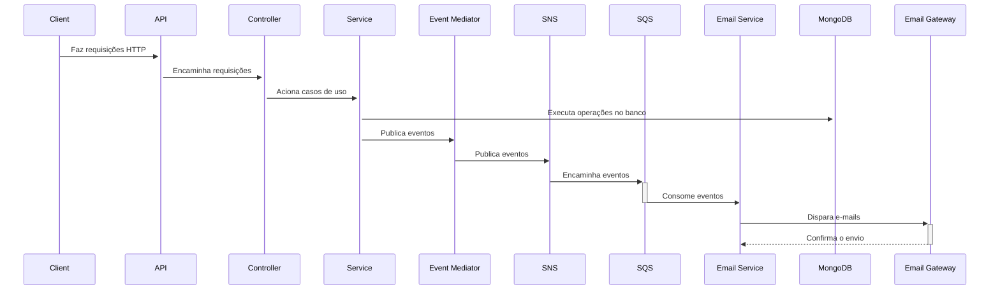

# event-driven-appointment-scheduling
Event driven appointment scheduling is a sample project using FastAPI, MongoDB, AWS SNS/SQS, and Mandrill to create an asynchronous scheduling system. It uses clean code architecture and email notifications to ensure reliability and availability

